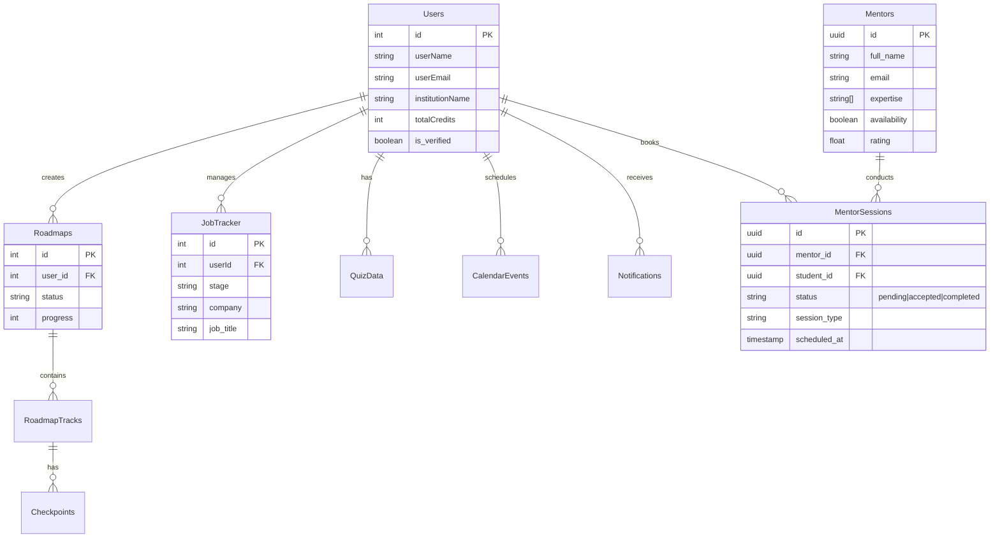

# Database Schema Design

The database is built on **PostgreSQL** (via Supabase). Below is the schema design derived from the application's data models.

## Entity Relationship Diagram (ERD)

## Table Definitions

### 1. Users
Stores all registered student data.
- `id`: Primary Key
- `userName`: Full name
- `userEmail`: Unique email address
- `totalCredits`: Currency for AI tools usage
- `institutionName`: School/College name
- `mainFocus`: User's primary career interest
- `isPro`: Premium subscription status

### 2. Mentors
Stores verified mentor profiles.
- `id`: Primary Key (UUID)
- `full_name`: Mentor's display name
- `expertise`: Array of skills (e.g., ["React", "System Design"])
- `current_position`: Job title and Company
- `availability`: Boolean toggle for booking
- `rating`: Average aggregate rating

### 3. MentorSessions
Connects Students and Mentors for video sessions.
- `id`: Primary Key
- `mentor_id`: Foreign Key -> Mentors
- `student_id`: Foreign Key -> Users
- `status`: Enum (pending, accepted, rejected, completed)
- `session_type`: Duration (10min, 30min, 45min)
- `vc_link`: WebRTC room link

### 4. JobTracker
Kanban-style board for users to track job applications.
- `stage`: saved, applied, interviewing, negotiating, hired
- `job_title`: Target role
- `company`: Target company
- `description`: Notes/details

### 5. Roadmaps & Tracks
AI-generated learning paths.
- **Roadmaps**: The high-level container for a goal (e.g., "Become a Backend Dev").
- **RoadmapTracks**: Specific modules/units within the roadmap.
- **Checkpoints**: Milestones with specific resources and quizzes.
