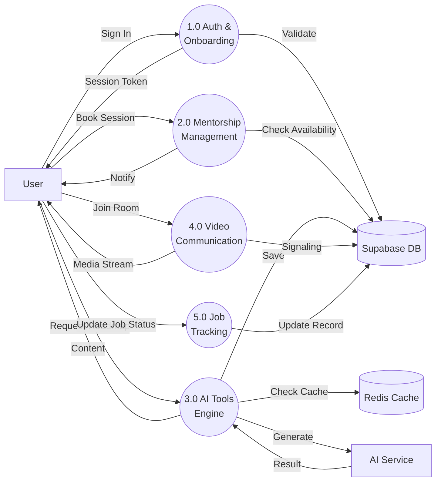
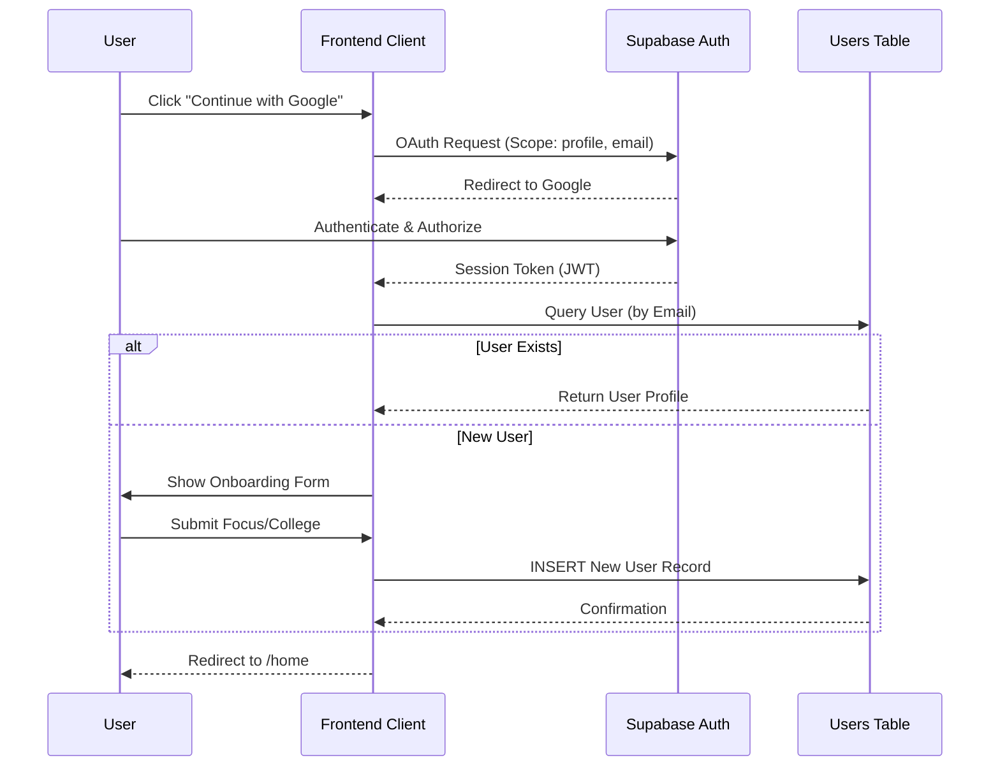
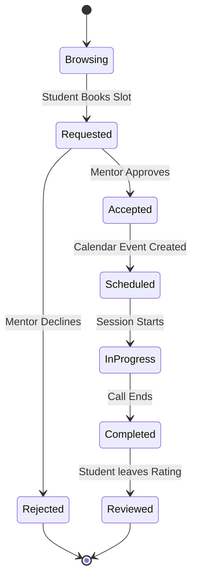
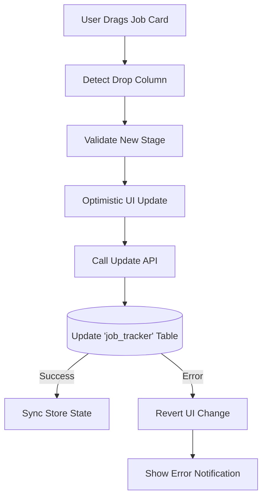

# Data Flow Diagrams (DFD) - Nano Banana Pro Edition 🍌

This document outlines the flow of data through the **Clarioo** system, featuring high-fidelity process maps for advanced system components.

## 0. Level 0: Context Diagram
The highest-level view of the system ecosystem.

```mermaid
graph TD
    %% External Entities
    Student[User / Student]
    Mentor[Mentor]
    Google[Google Auth / APIs]
    LLM[Gemini AI Model]
    Bank[Payment Gateway]
    Supabase[Supabase Platform]

    %% System
    System((Clarioo Platform))

    %% Data Flows
    Student -->|Credentials / Profile Data| System
    System -->|Dashboard / Content| Student
    
    Mentor -->|Availability / Session Notes| System
    System -->|Booking Requests / Schedule| Mentor
    
    System -->|Auth Tokens / Calendar Sync| Google
    Google -->|User Data / Events| System
    
    System -->|Prompts (Roadmap/Quiz)| LLM
    LLM -->|Generated Content (JSON)| System
    
    Student -->|Payment Details| System
    System -->|Transaction Request| Bank
    Bank -->|Confirmation| System
    
    System <-->|Realtime Subscriptions| Supabase
```

## 1. Level 1: System Breakdown
Core functional processes interacting with data stores.



## 2. Detailed Data Flows (Level 2)

### 2.1 Authentication Process
OAuth + Onboarding logic.



### 2.2 AI Roadmap Generation Flow
Complex AI generation with Redis caching strategy.

```mermaid
flowchart TD
    Start([User Requests Roadmap]) --> Valid{Has Credits?}
    Valid -- No --> Error([Show "Upgrade" Prompt])
    Valid -- Yes --> CheckCache{Check Redis Cache}
    
    CheckCache -- Hit --> FetchCache[Fetch JSON from Redis]
    FetchCache --> Render
    
    CheckCache -- Miss --> Construct[Construct Prompt with \nUser Context]
    Construct --> CallAI[Call Google Gemini API]
    CallAI --> Parse[Parse JSON Response]
    Parse --> SaveDB[(Save to 'Roadmaps' Table)]
    SaveDB --> CacheStore[Store in Redis \n(TTL: 24h)]
    CacheStore --> Deduct[Deduct User Credits]
    Deduct --> Render([Render Interactive Roadmap])
```

### 2.3 Mentor Booking Lifecycle
State machine for session management.



### 2.4 Video Call Signaling (WebRTC)
Real-time peer connection establishment.

```mermaid
sequenceDiagram
    participant PeerA as User A (Caller)
    participant Signal as Supabase Realtime
    participant PeerB as User B (Callee)

    PeerA->>Signal: SUBSCRIBE to Room Channel
    PeerB->>Signal: SUBSCRIBE to Room Channel
    
    PeerA->>PeerA: Create Offer (SDP)
    PeerA->>Signal: PUBLISH 'offer' payload
    Signal->>PeerB: BROADCAST 'offer'
    
    PeerB->>PeerB: Set Remote Desc (Offer)
    PeerB->>PeerB: Create Answer (SDP)
    PeerB->>Signal: PUBLISH 'answer' payload
    Signal->>PeerA: BROADCAST 'answer'
    
    PeerA->>PeerA: Set Remote Desc (Answer)
    
    Note right of PeerA: ICE Candidate Exchange
    PeerA->>Signal: PUBLISH 'ice-candidate'
    Signal->>PeerB: BROADCAST 'ice-candidate'
    PeerB->>Signal: PUBLISH 'ice-candidate'
    Signal->>PeerA: BROADCAST 'ice-candidate'
    
    PeerA<-->>PeerB: P2P Media Stream Established 🎥
```

### 2.5 Job Application Tracker
Kanban board logic flow.


