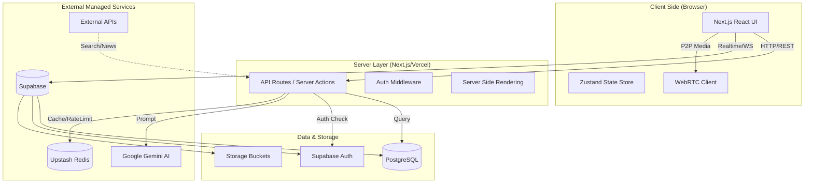

# System Design & Architecture

## 1. High-Level Architecture

The **Clarioo** platform utilizes a modern, serverless-first architecture leveraging **Next.js 16** for both the frontend and backend API layers. It integrates best-in-class managed services for database, authentication, and AI capabilities.

## 2. Technology Stack

| Layer | Technology | Purpose |
|-------|------------|---------|
| **Frontend** | Next.js 16, React 19, Tailwind CSS 4 | Core application framework and UI rendering. |
| **Backend** | Next.js App Router (Node.js) | Server-less API endpoints and server-side logic. |
| **Database** | Supabase (PostgreSQL) | Primary relational data store and realtime subscriptions. |
| **Auth** | Supabase Auth | User management (Email, Google OAuth). |
| **AI Engine** | Google Gemini 1.5, LangChain | Generative AI for roadmaps, quizzes, and resume analysis. |
| **Caching** | Upstash Redis | Caching AI responses and API rate limiting. |
| **Realtime** | WebRTC, Socket.io (Custom) | Video calling and peer-to-peer communication. |
| **Visuals** | Three.js, Spline | 3D interactive elements and seamless UX. |

## 3. Scalability & Future Growth

### Horizontal Scaling
- **Serverless Compute**: Next.js API routes run on serverless functions (e.g., Vercel or AWS Lambda), allowing the application to automatically scale up to handle thousands of concurrent requests without manual intervention.
- **Database Read Replicas**: As read traffic grows (e.g., users fetching roadmaps/content), Supabase supports adding read replicas to distribute the load.

### Caching Strategy
- **Edge Caching**: Static assets and static pages are cached at the CDN edge associated with the Next.js deployment.
- **API Caching**: `Upstash Redis` is used to cache expensive AI generation results. If a user requests a roadmap for "Frontend Dev" that was generated recently, it is served from the cache, reducing costs and latency elements.

## 4. Failure Scenarios & Reliability

### Handling AI Service Failures
- **Fallback Mechanisms**: If the Google Gemini API experiences downtime or high latency, the system captures the error and alerts the user. 
- **Graceful Degradation**: Critical features (like profile, dashboard) remain functional even if AI tools are temporarily unavailable.
- **Retries**: API calls to external services utilize exponential backoff retry strategies to handle transient network glitches.

### Database Reliability
- **Connection Pooling**: Supabase PgBouncer is configured to manage database connections efficiently, preventing connection exhaustion during traffic spikes.
- **Data Integrity**: Enforced via PostgreSQL foreign key constraints and robust transaction manageent (ACID compliance).

### Frontend Resilience
- **Error Boundaries**: React Error Boundaries are implemented to catch component-level errors without crashing the entire application.
- **Optimistic UI**: The UI updates immediately for user actions (like "Mark as Done") while the server request processes in the background, providing a snappy experience even on slower networks.
